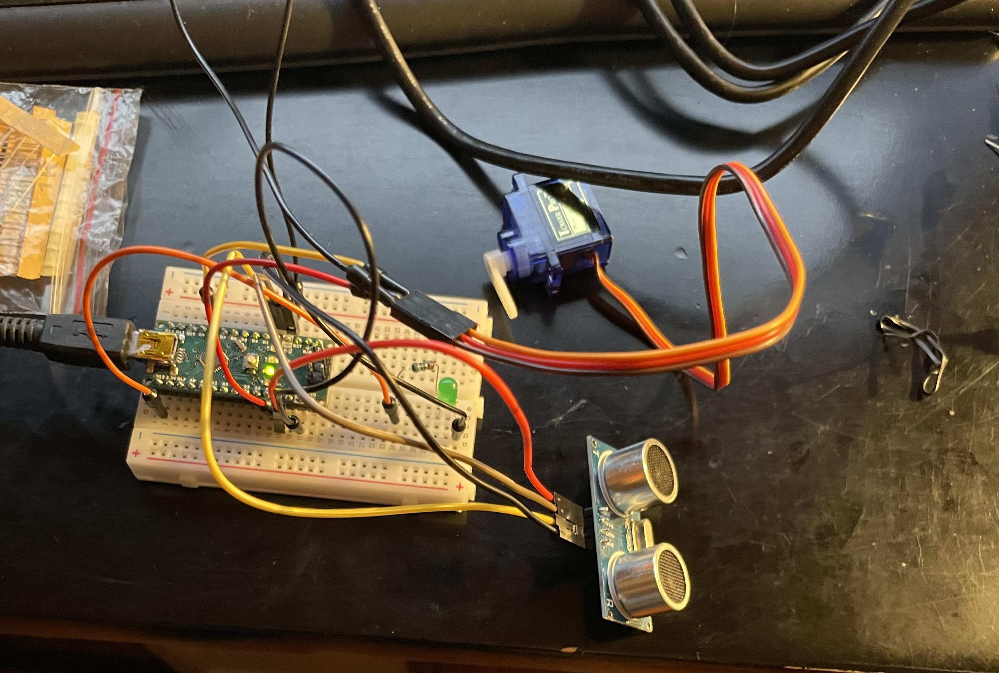
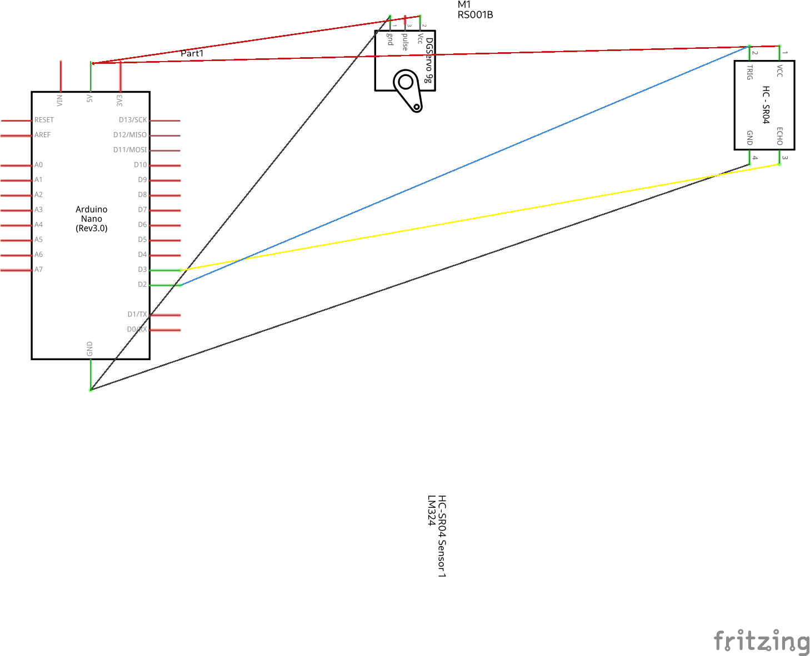
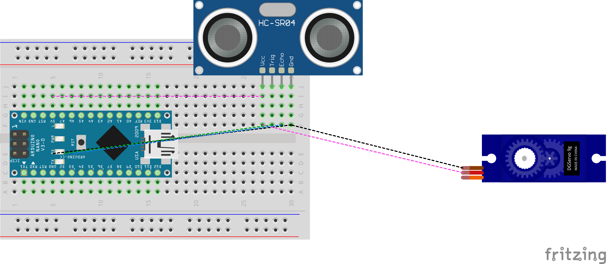
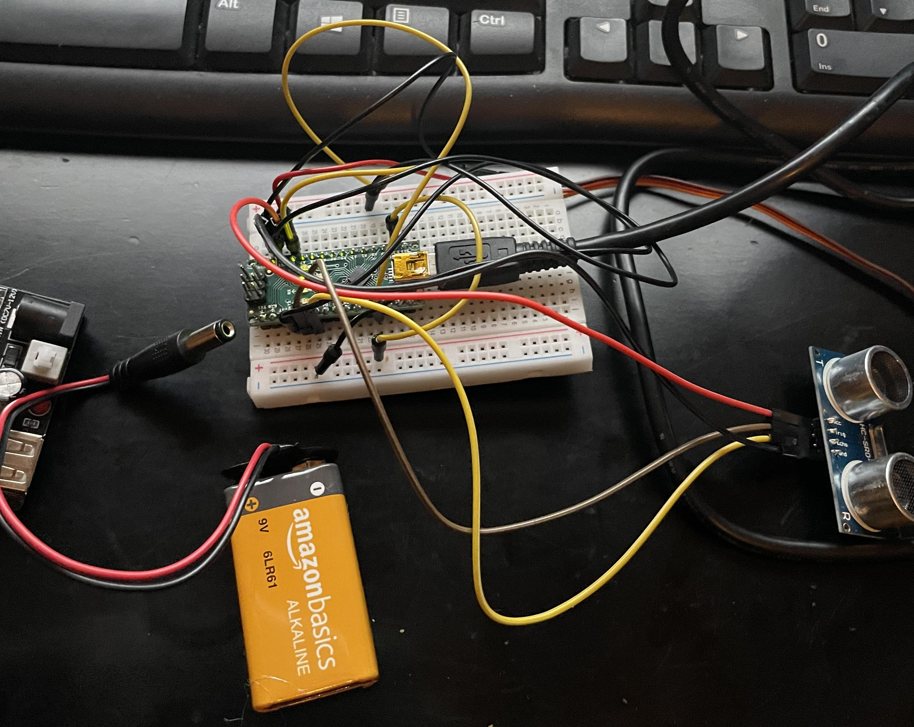
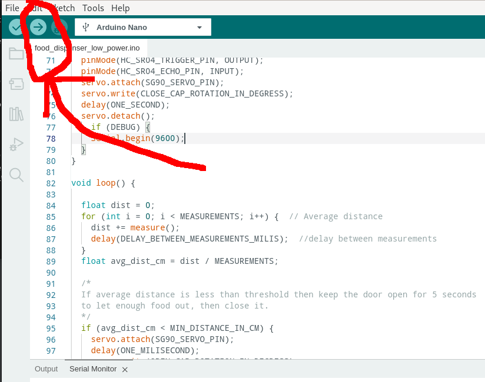
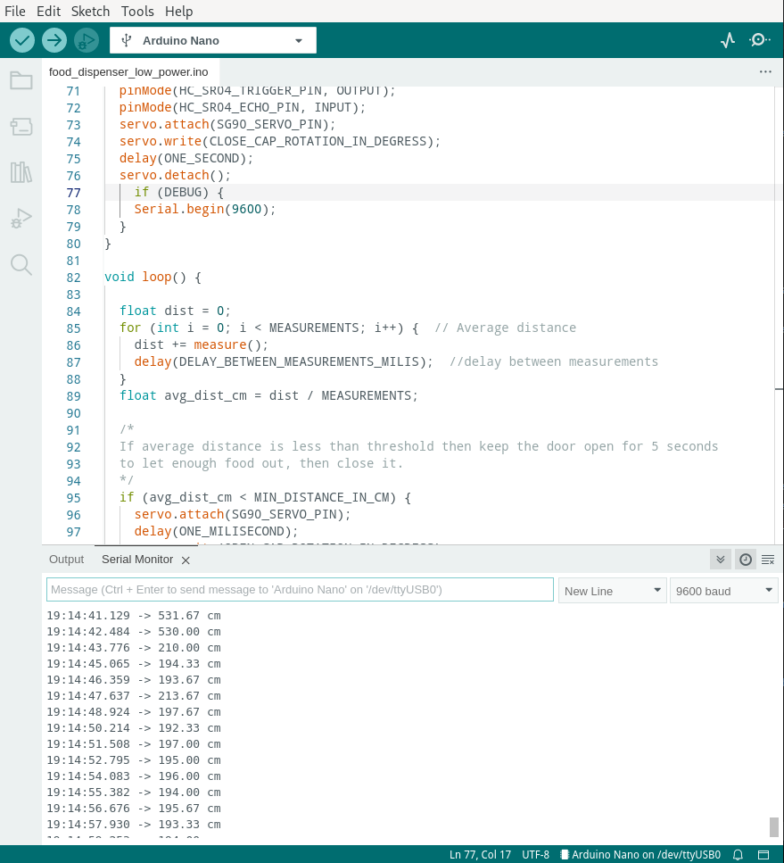
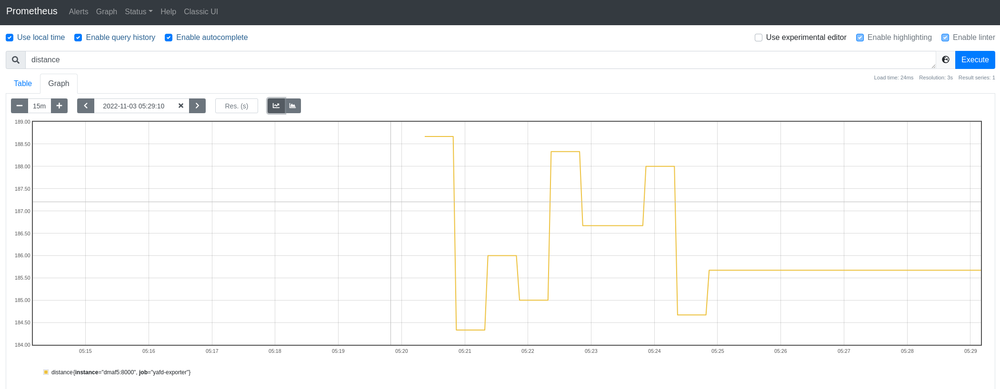

# Yet Another Food Dispenser (YAFD)

I want to share with you a small automation project me and my daughter did together ([check the video here](https://youtu.be/6d5doXD2x5c)); She had an idea to make a food dispenser for our dog, Domino and I tough it would be the perfect excuse to write some code that also interfaced with real hardware.

We chose [an Arduino hardware](https://www.arduino.cc/en/Guide/Introduction), as it has a huge support community, and it is very inexpensive way to introduce yourself to DYI electronics:



## What is an Arduino?

> Arduino is an open-source electronics platform based on easy-to-use hardware and software.

We used the [Arduino Nano](https://store-usa.arduino.cc/products/arduino-nano) for this project, due its very small size and price.

## Not original work, I found lots of inspiration (and instructors) and you should do the same

I didn't come up with the idea or the code myself; ROBO HUB [wrote a detailed tutorial ](https://www.instructables.com/Automatic-Food-Dispenser-From-Arduino/) on now to make a pet food dispenser with basic materials, and I took notes. 

He also made [a video](https://youtu.be/zQ8SjIcYC5w), which I ended watching many times over (one of the many on his [YouTube](https://www.youtube.com/c/jeevanjee) channel).

## How does the food dispenser work?

In a nutshell the food dispenser work like this:

1. Food sits tall inside a cardboard enclosure; at the bottom there is a lid that opens to let the food fall, when an obstacle is detected in front of the food dispenser
2. The lid only opens when the obstacle is less than 35 cms from the food dispenser; it waits for 5 seconds after is open and the closes again.
3. The servo rotates 90 degrees, with is just enough to fully open the lid, then it moves it back to the zero degree position.

## What materials you will need to build this project

All my links are to the Amazon store because it is easy to see the product there before buying; I do not get a commission, and I encourage you to look somewhere else to get the best price.

### Electronics
* [Arduino Nano](https://a.co/d/i2iR7Ok) [A000005]: The brain of our project; we will go in more details in a bit, choose this one due its price and size.
* [Chanzon 9v Battery Clip with 2.1x5.5mm Male DC Connector](https://a.co/d/buH4FAY) T-Type with Leather Housing and Lead Wire Pack of 5pcs kit for Arduino LED Strip: We will use it to connect a 5V battery to our Arduino, so it can run without being attached to the computer through the USB cable. 
* [ACEIRMC HC-SR04 Ultrasonic Sensor Distance Module](https://a.co/d/hssh2KL) for Nano Robot XBee ZigBee by ElecRight（5pcs:  Will use this to detect if a pet is in front of the dispenser, and if true, dispense the food.
* [Smraza Basic Starter Kit for Arduino,Breadboard, Power Supply, Jumper Wires](https://a.co/d/dbi7LBT), Resistors, LED, Electronic Fun Kit Compatible with Arduino R3, Mega2560, Nano, Raspberry Pi: This starter kit gave me the power supply and the breadboard to connect the Arduino with other components; Also we have plans to do other projects with the components that come on the box.
* [4Pcs SG90 9g Micro Servos](https://a.co/d/dXxA2Uo) for RC Robot Helicopter Airplane Controls Car Boat: Will use this to open/ close the trap door inside the food dispenser enclosure.

### To build the enclosure
* [Gluerious Mini Hot Glue Gun](https://a.co/d/2bjW3aK) with 30 Glue Sticks for Crafts School DIY Arts Home Quick Repairs, 20W, Blue: Any glue gun will do, no need to get something fancy.
* Basics Multipurpose, [Scissors](https://a.co/d/73XAe6b)
* [Folding Utility Knife](https://a.co/d/2PfXAYe) - Lightweight Aluminum Body with Holster: I ended cutting holes that were too small for scissors.
* A cardboard box: Do not underestimate the height, look for something no less than 12 inches tall; I ended using a square box, but you may end using a cylinder _like the original tutorial_ (the square box made it easier for me to place the components inside); same can be said for the width, you will need space to place the electronic components inside, plus the food.

### Software

* [SUDO](https://www.sudo.ws/) privileges to install one more packages like minicom (read data from the serial port) and Fritz (to make some nice looking drawings of our project)
* Download the [Arduino IDE 2](https://www.arduino.cc/en/software), we will write the code we need to control our electronics there.
* Python3 to run a few scripts to publish our ultrasonic sensor data as Prometheus metrics, using the computer.

But next I will give you the most important piece of advice for the whole tutorial.

## Perfect is the enemy of good

Voltaire, quoted an [Italian proverb](https://en.wikipedia.org/wiki/Perfect_is_the_enemy_of_good):

> Dans ses écrits, un sage Italien
> Dit que le mieux est l'ennemi du bien.

The whole point of this exercise is to _learn and make mistakes (trying to avoid repeating the old ones)_; Not looking for the perfect mousetrap (or food dispenser), but rather one that works decently well, and we can improve over several iterations.

Let's get started and see how we can connect the electronic components first; You can watch [a video of the whole process here](https://youtu.be/6d5doXD2x5c) and then come back to follow this tutorial.

## Connecting the components

The schematic looks like this:



When you assemble a project in Arduino, you connect components to either the digital or analog [pins](https://docs.arduino.cc/learn/microcontrollers/digital-pins), which are numbered; For my project I did this:

1. HC-SR04 Ultrasonic Trigger connects to pin D2 on Arduino Nano. The trigger side of the sensor sends the pulse that will bounce on the obstacle (for [more detailed explanation](https://youtu.be/2ojWO1QNprw) watch this).
2. HC-SR04 Ultrasonic Echo connects to pin D3 on Arduino Nano. This gets back the bouncing pulse, to get the distance between the fod dispenser and the obstacle we measure how long it too to travel and using the speed of sound we calculate the distance. 
3. SG90 Servo connects to pin D9 on Arduino Nano. This moves on a 90-degree angle if an obstacle is detected and the distance is less than 35 cm (or whatever you choose in the code) 

The rest of the 5V and Ground connect to the Arduino Nano as well; because it has so many connections, I used a [solderless breadboard](https://protosupplies.com/guide-to-solderless-breadboards/):



But if you are like me you rather see a photo of all the components connected together with a breadboard:



You may be wondering how I made these diagrams.
The open source application [Fritzing](https://fritzing.org) is a great way to draw out electronic schematics and wiring diagrams, and it's available on Fedora as an RPM:

```shell
sudo dnf install -y fritzing.x86_64 fritzing-parts.noarch
```

On RHEL and CentOS, you can install it as a [Flatpak](https://flathub.org/apps/details/org.fritzing.Fritzing):

```shell
flatpak install org.fritzing.Fritzing
```

I've included the diagram source file (`schematics/food_dispenser.fzz`) in the Git repository, so you can open them and modify their contents at will.

## Writing code for the Arduino controller

If you haven't downloaded and installed the Arduino 2 IDE please do it now, [just follow these instructions](https://docs.arduino.cc/software/ide-v2/tutorials/getting-started/ide-v2-downloading-and-installing), and then move on.

You can write code for the Arduino using their programing language; It looks a lot like C, and it has 2 very simple and important functions:

* setup: You initialize the components, set up which ports can read and write data. Called only once.
* loop: Here is where you do work reading and writing data to the sensors.

I found than the original code needed a few updates to cover my use case, but it is a good idea to take a look and run it just to learn how it works:

```shell
curl --fail --location --remote-name 'http://letsmakeprojects.com/wp-content/uploads/2020/12/arduino-code.docx'
```

Yes, you will need to copy and paste on the IDE.

In any case, I [re-wrote the original code](sketches/food_dispenser/food_dispenser.ino) keeping the most functionality intact, and added extra debugging to see if the ultrasound sensor were able to pick the distance when an obstacle was found:

```
/*
Sketch to control the motor that open/ closes the cap that lets the food drop on the dispenser.
References: 
* https://www.arduino.cc/reference/en/
* https://create.arduino.cc/projecthub/knackminds/how-to-measure-distance-using-ultrasonic-sensor-hc-sr04-a-b9f7f8

Modules:
- HC-SR04: Ultrasonic sensor distance module
- SG90 9g Micro Servos: Opens / closes lid on the food dispenser
*/
#include <Servo.h>
Servo servo;

unsigned int const DEBUG = 1;

/*
Pin choice is arbitrary.
 */ 
const unsigned int HC_SR04_TRIGGER_PIN = 2; // Send the ultrasound ping
const unsigned int HC_SR04_ECHO_PIN = 3; // Receive the ultrasound response
const unsigned int SG90_SERVO_PIN = 9;  // Activate the servo to open/ close lid

const unsigned int MEASUREMENTS = 3;
const unsigned int DELAY_BETWEEN_MEASUREMENTS_MILIS = 50;

const unsigned long ONE_MILISECOND = 1;
const unsigned long ONE_SECOND = 1000;
const unsigned long FIVE_SECONDS = 3000;

const unsigned long MIN_DISTANCE_IN_CM = 35; // Between 2cm - 500cm

const unsigned int OPEN_CAP_ROTATION_IN_DEGRESS = 90; // Between 0 - 180
const unsigned int CLOSE_CAP_ROTATION_IN_DEGRESS = 0;

const unsigned int CLOSE = 0;

/*
Speed of Sound: 340m/s = 29microseconds/cm
Sound wave reflects from the obstacle, so to calculate the distance we consider half of the distance traveled.  
DistanceInCms=microseconds/29/2 
*/
long microsecondsToCentimeters(long microseconds) {
  return microseconds / 29 / 2;
}

unsigned long measure() {
  /*
  Send the ultrasound ping
  */
  digitalWrite(HC_SR04_TRIGGER_PIN, LOW);
  delayMicroseconds(5);
  digitalWrite(HC_SR04_TRIGGER_PIN, HIGH);
  delayMicroseconds(15);
  digitalWrite(HC_SR04_TRIGGER_PIN, LOW);

  /*
  Receive the ultrasound ping and convert to distance
  */
  unsigned long pulse_duration_ms = pulseIn(HC_SR04_ECHO_PIN, HIGH);
  return microsecondsToCentimeters(pulse_duration_ms);
}


/*
- Close cap on power on startup
- Set servo, and read/ write pins
 */
void setup() {
  pinMode(HC_SR04_TRIGGER_PIN, OUTPUT);
  pinMode(HC_SR04_ECHO_PIN, INPUT);
  servo.attach(SG90_SERVO_PIN);
  servo.write(CLOSE_CAP_ROTATION_IN_DEGRESS);
  delay(ONE_SECOND);
  servo.detach();
  if (DEBUG) {
    Serial.begin(9600);
  }
}

void loop() {
  float dist = 0;
  for (int i = 0; i < MEASUREMENTS; i++) {  // Average distance
    dist += measure();
    delay(DELAY_BETWEEN_MEASUREMENTS_MILIS);  //delay between measurements
  }
  float avg_dist_cm = dist / MEASUREMENTS;

  /*
  If average distance is less than threshold then keep the door open for 5 seconds 
  to let enough food out, then close it.
  */
  if (avg_dist_cm < MIN_DISTANCE_IN_CM) {
    servo.attach(SG90_SERVO_PIN);
    delay(ONE_MILISECOND);
    servo.write(OPEN_CAP_ROTATION_IN_DEGRESS);
    delay(FIVE_SECONDS);
    servo.write(CLOSE_CAP_ROTATION_IN_DEGRESS);
    delay(ONE_SECOND);
    servo.detach();
  }

  if (DEBUG) {
    Serial.print(avg_dist_cm);
    Serial.print("cm");
    Serial.println();
  }

}
```

Compiling and deploying from the Arduino GUI is easy, just click the arrow icon, after selecting the board and port from the pulldown menu:



It would say something like this once the code is uploaded:

```
Sketch uses 3506 bytes (11%) of program storage space. Maximum is 30720 bytes.
Global variables use 50 bytes (2%) of dynamic memory, leaving 1998 bytes for local variables. Maximum is 2048 bytes.
```

## Issues found once the first prototype was up and running

Not everything was perfect with this pet project (pun intended):

### Battery life decreased dramatically just after a few hours

The loop in the code constantly keeps sending ultrasonic "ping" and checking the distance; After looking around I found a [library compatible](https://github.com/LowPowerLab/LowPower) with the ATMega328P controller (used on the Arduino One).

I enabled the debug code to monitor the serial port, and I constantly saw messages like this:

```text
14:13:59.094 -> 281.00cm
14:13:59.288 -> 281.67cm
14:13:59.513 -> 280.67cm
14:13:59.706 -> 281.67cm
14:13:59.933 -> 281.33cm
14:14:00.126 -> 281.00cm
14:14:00.321 -> 300.33cm
...
14:20:00.321 -> 16.00cm
...
```

The [new version that powers down for a bit](sketches/food_dispenser_low_power/food_dispenser_low_power.ino) to save energy is here:

```
/*
Sketch to control the motor that open/ closes the cap that lets the food drop on the dispenser.
References: 
* https://www.arduino.cc/reference/en/
* https://create.arduino.cc/projecthub/knackminds/how-to-measure-distance-using-ultrasonic-sensor-hc-sr04-a-b9f7f8

Modules:
- HC-SR04: Ultrasonic sensor distance module
- SG90 9g Micro Servos: Opens / closes lid on the food dispenser
*/
#include "LowPower.h"
#include <Servo.h>
Servo servo;

unsigned int const DEBUG = 1;

/*
Pin choice is arbitrary.
 */ 
const unsigned int HC_SR04_TRIGGER_PIN = 2; // Send the ultrasound ping
const unsigned int HC_SR04_ECHO_PIN = 3; // Receive the ultrasound response
const unsigned int SG90_SERVO_PIN = 9;  // Activate the servo to open/ close lid

const unsigned int MEASUREMENTS = 3;
const unsigned int DELAY_BETWEEN_MEASUREMENTS_MILIS = 50;

const unsigned long ONE_MILISECOND = 1;
const unsigned long ONE_SECOND = 1000;
const unsigned long FIVE_SECONDS = 3000;

const unsigned long MIN_DISTANCE_IN_CM = 35; // Between 2cm - 500cm

const unsigned int OPEN_CAP_ROTATION_IN_DEGRESS = 90; // Between 0 - 180
const unsigned int CLOSE_CAP_ROTATION_IN_DEGRESS = 0;

const unsigned int CLOSE = 0;

/*
Speed of Sound: 340m/s = 29microseconds/cm
Sound wave reflects from the obstacle, so to calculate the distance we consider half of the distance traveled.  
DistanceInCms=microseconds/29/2 
*/
long microsecondsToCentimeters(long microseconds) {
  return microseconds / 29 / 2;
}

unsigned long measure() {
  /*
  Send the ultrasound ping
  */
  digitalWrite(HC_SR04_TRIGGER_PIN, LOW);
  delayMicroseconds(5);
  digitalWrite(HC_SR04_TRIGGER_PIN, HIGH);
  delayMicroseconds(15);
  digitalWrite(HC_SR04_TRIGGER_PIN, LOW);

  /*
  Receive the ultrasound ping and convert to distance
  */
  unsigned long pulse_duration_ms = pulseIn(HC_SR04_ECHO_PIN, HIGH);
  return microsecondsToCentimeters(pulse_duration_ms);
}


/*
- Close cap on power on startup
- Set servo, and read/ write pins
 */
void setup() {
  pinMode(HC_SR04_TRIGGER_PIN, OUTPUT);
  pinMode(HC_SR04_ECHO_PIN, INPUT);
  servo.attach(SG90_SERVO_PIN);
  servo.write(CLOSE_CAP_ROTATION_IN_DEGRESS);
  delay(ONE_SECOND);
  servo.detach();
    if (DEBUG) {
    Serial.begin(9600);
  }
}

void loop() {

  float dist = 0;
  for (int i = 0; i < MEASUREMENTS; i++) {  // Average distance
    dist += measure();
    delay(DELAY_BETWEEN_MEASUREMENTS_MILIS);  //delay between measurements
  }
  float avg_dist_cm = dist / MEASUREMENTS;

  /*
  If average distance is less than threshold then keep the door open for 5 seconds 
  to let enough food out, then close it.
  */
  if (avg_dist_cm < MIN_DISTANCE_IN_CM) {
    servo.attach(SG90_SERVO_PIN);
    delay(ONE_MILISECOND);
    servo.write(OPEN_CAP_ROTATION_IN_DEGRESS);
    delay(FIVE_SECONDS);
    servo.write(CLOSE_CAP_ROTATION_IN_DEGRESS);
    delay(ONE_SECOND);
    servo.detach();
    // Pet is eating and in front of the dispenser, we can definitely sleep longer
    LowPower.powerDown(SLEEP_8S, ADC_OFF, BOD_OFF);
  } else {
    LowPower.powerDown(SLEEP_1S, ADC_OFF, BOD_OFF);
  }

  if (DEBUG) {
    Serial.print(avg_dist_cm);
    Serial.print(" cm");
    Serial.println();
  }
}
```

The battery lasted around 3 hours more after this change, but still I want to squeeze more power; The Arduino guide [as lots more suggestions](https://docs.arduino.cc/learn/electronics/low-power?queryID=4bb7e80ccdadebbb0d28e99a4638f2ca), and of course [there is much more on the topic of saving energy](http://www.gammon.com.au/forum/?id=11497), but this is a good start.

What other issues we have? Move on to the next item.

### The 3.3V/ 5V MB102 Solderless Breadboard Power Supply Module **has the power led on all the time**

There is no way to disable, that also contributes to kill the battery; more research from my part is needed here.

Time to check the next issue.

### Capacity on the food thank is very limited, but enclosure to put the electronics worked well

A bigger container is needed as the electronics took most of the space; Our dimensions where width 5.5 x 2.5 inches x 18 inches tall (height was good enough).

I plan to build a wider, but not taller, enclosure; I did waste space on the bottom of the dispenser and this is maybe a good place to place the electronics.

The decision to use a small breadboard was good too.

## Things went well from the beginning:

Other decisions proved to be the solid ones:

* I only had to glue together the servo to the cardboard, but all the pieces including the lid can be disassembled with ease (including the battery), so I can still tweak the code without painful re-assembling; I like the design.
* Food doesn't get stuck inside the container, gravity does its work and there is no waste once all the food is gone.
* We did not use a cylinder for the enclosure but a rectangle and in my opinion it made fitting the parts much easier; if you are like me and have a small long box that you can recycle then you are all set.

## Fine-tuning the dispenser, by capturing output from the Arduino serial port

If you are like me, you like to capture your data for later analysis; you may want to do the following:

* Alert if the external battery is about to be depleted, or even monitor how much charge is left (if possible)
* Get the distance when the ultrasonic sensor is tripped; You can use this to better calibrate the food dispenser, for example, is the plate too close or too far.
* With more work, alert if the food inside the dispenser is about to run out before your pet fills a bug request.

The Arduino UI has a nice way to show the activity on the USB serial port (and also allows you to send commands to the Arduino that way):



Let's see now how you can capture data from `/dev/ttyUSB0` (that's the name of the device on my Fedora Linux install).

### The easiest way, using minicom

You can open the serial port using [minicom](https://en.wikipedia.org/wiki/Minicom).

To install it on Fedora, CentOS, RHEL, and similar:

```shell
[josevnz@dmaf5 Documents]$ sudo dnf install  minicom
```

Then to capture data, you can run like this (make sure you are not capturing from the Arduino IDE 2, otherwise the device will be locked):

```shell
[josevnz@dmaf5 Documents]$ minicom --capturefile=$HOME/Downloads/ultrasonic_sensor_cap.txt --baudrate 9600 --device /dev/ttyUSB0
```

See it in action:

[](https://asciinema.org/a/534170)

But it is not the only way to capture data, what if we use Python for this?

### Using Python to capture the serial port data

Of course, you can achieve the same with a [very simple Python script](scripts/serial_port_dumper.py):

```python
#!/usr/bin/env python
"""
Simple script to dump the contents of a serial port (ideally your Arduino USB port)
Author: Jose Vicente Nunez (kodegeek.com@protonmail.com)
"""
import serial

BAUD = 9600
TIMEOUT = 2
PORT = "/dev/ttyUSB0"

if __name__ == "__main__":
    serial_port = serial.Serial(port=PORT, baudrate=BAUD, bytesize=8, timeout=TIMEOUT, stopbits=serial.STOPBITS_ONE)
    try:
        while True:
            # Wait until there is data waiting in the serial buffer
            if serial_port.in_waiting > 0:
                serialString = serial_port.readline()
                # Print the contents of the serial data
                print(serialString.decode('utf-8').strip())
    except KeyboardInterrupt:
        pass
```

But our [Python script](scripts/prometheus_yafd_exporter.py) doesn't have to be poor copy of minicom; what if we export our data by using the [Prometheus client SDK](https://github.com/prometheus/client_python)?.

Let me show you a demo below:

[](https://asciinema.org/a/534507)

Then we can monitor our new datasource from the Prometheus scrapper UI, but first we need to tell our Prometheus agent where is it.

Below you can see several scrape job configs, last one ('yafd') is the new python script:

```yaml
--
global:
    scrape_interval: 30s
    evaluation_interval: 30s
    scrape_timeout: 10s
    external_labels:
        monitor: 'nunez-family-monitor'

scrape_configs:
    - job_name: 'node-exporter'
      static_configs:
          - targets: ['raspberrypi.home:9100', 'dmaf5:9100']
    - job_name: 'docker-exporter'
      static_configs:
          - targets: ['raspberrypi.home:9323', 'dmaf5:9323']
    - job_name: 'yafd-exporter'
      static_configs:
          - targets: ['dmaf5:8000']
      tls_config:
          insecure_skip_verify: true
```

After that you can check it on the Prometheus dashboard:



Then you can add it to Grafana, and even add alerts there to get notified when your dog gets food (OK, maybe that's too much)

## What is next for you?

This project was very exciting, nothing beats mixing hardware and software development.

Below are some ideas I want to share with you:

* If you have kids, [get them involved](https://youtu.be/6d5doXD2x5c): *The best part was getting my daughter interested in electronics and software*; she had a blast putting this together with me, our design sessions were probably the most productive parts of the project.
* You may want to buy an inexpensive learning kit that has an Arduino controller; mine has good documentation and [lots of tutorials you can follow online](https://geekdiywiki.com:4433/wiki/index.php/Smraza), but because the hardware is Open Source there lots of makers out there.
* While we were looking into lowering the power consumption on my Arduino board, I stumbled [into using Solar power with the boards](https://footprinthero.com/how-to-solar-power-an-arduino); I strongly recommend you read this article, it may make a difference on your next project.
* Looking for a module for your board? The [Arduino Libraries](https://github.com/arduino-libraries) Open Source module may have it already.
* There is plenty of hardware improvement for this food dispenser, like add more food capacity, ability to upload instrumentation data, so it can be monitored remotely, track how much food is left on the container, etc. So many possibilities!
